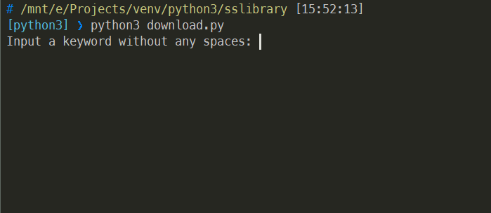
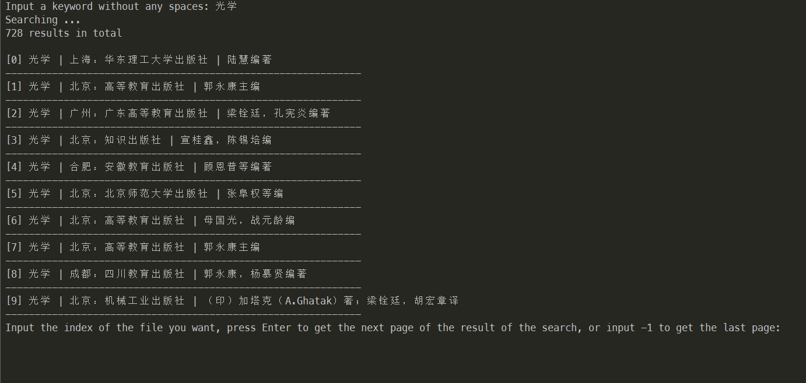

# sslibrary的pdf资料下载器
从http://www.sslibrary.com 上下载pdf资料，这大概只有国人用吧。。。so no english version

sslibrary的pdf格式文件只提供在线阅读，很麻烦，通过本项目的程序即可下载下来。这样就不需要sslibrary的特制阅读器了，直接用普通的pdf阅读器打开。

## 前提

1. 你的IP有权限下载sslibrary的文件，比如校园网用户并且学校买了sslibrary
2. python 3.x
3. 通过pip安装requests、PyPDF2和Pillow模块

## 使用方法

```bash
pip3 install requests PyPDF2 PIL
python3 download.py
```

正确运行后会是这样：



输入关键词进行搜索，比如搜索“光学”：



此时输入列表中的序号，即可下载对应的资料。我限制了每次显示10个结果，什么都不输入直接按回车，即可显示下一页，如果要返回上一页，就输入-1。

下载的资料位置在当前目录下的对应资料名的文件夹内，文件名为Merged.pdf。

默认8线程下载，速度还是可以滴~

## 已知问题

sslibrary上的图片型书籍，如果抓太快，会导致资源不可访问，不知道是不是被ban，即使换UA也没用，目前的解决方案是每抓一页就停一秒，默认8线程下载的情况下还是可以的，但最好要再想个更好的办法。

Python 3.x的Pillow模块在将图片转成pdf后，分辨率会变？应该说，是锐化了，有点奇怪，如果有替代品就更好了。

## TODO

1. 出错恢复
2. 提供命令行参数版，方便批量下载
3. 提供更多的资料搜索选项
4. 支持登录
5. 其他
